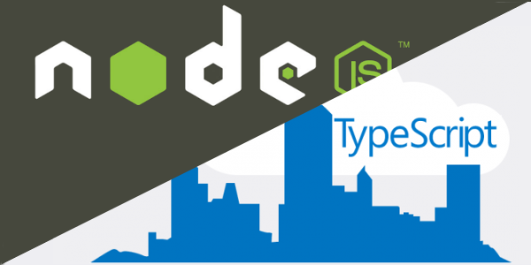

Building RESTful Web APIs with Node.js, Express, MongoDB and TypeScript
===================================================================================================

This is a simple API that saves contact information of people.

    (Image from OctoPerf)

.. toctree::
   :maxdepth: 2
   :caption: Contents:

   introduction
   setting-up-project
   implement-routing-and-crud
   using-controller-and-model
   connect-web-apis-to-MongoDB
   security-for-our-web-apis

Indices and tables
==================

* :ref:`genindex`
* :ref:`modindex`
* :ref:`search`
